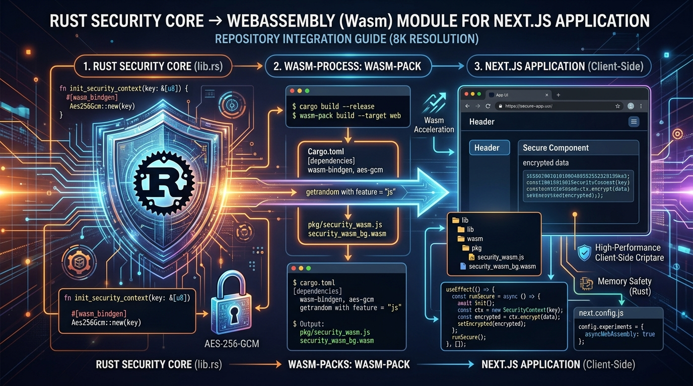
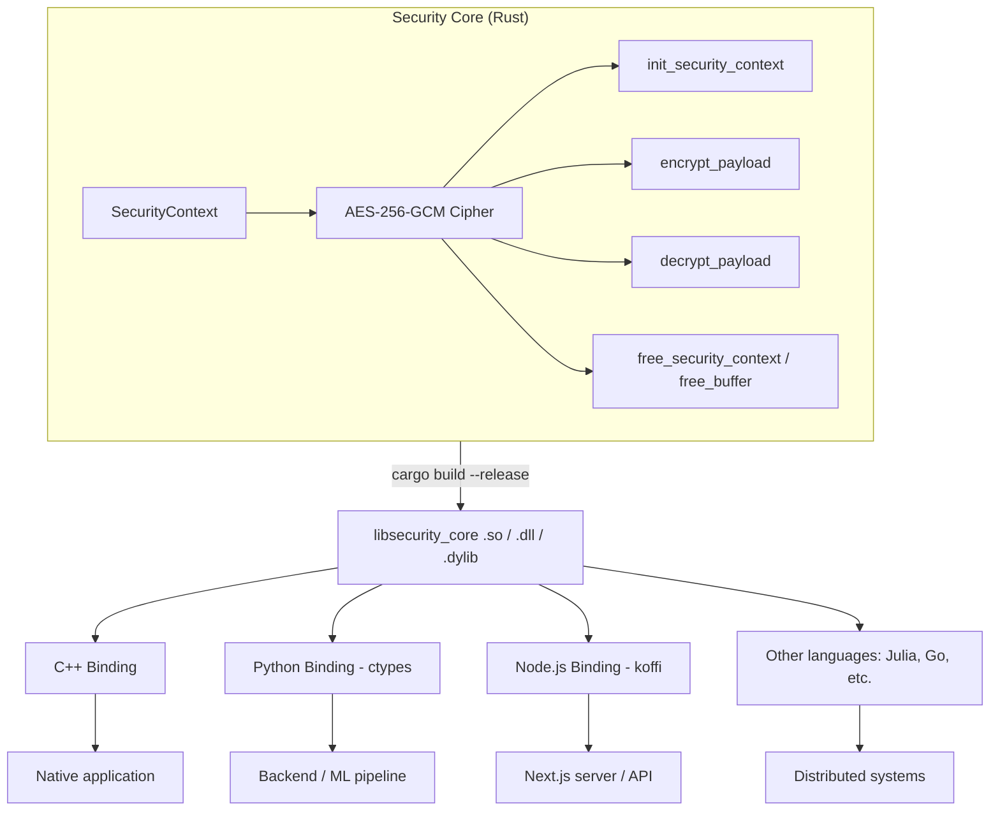
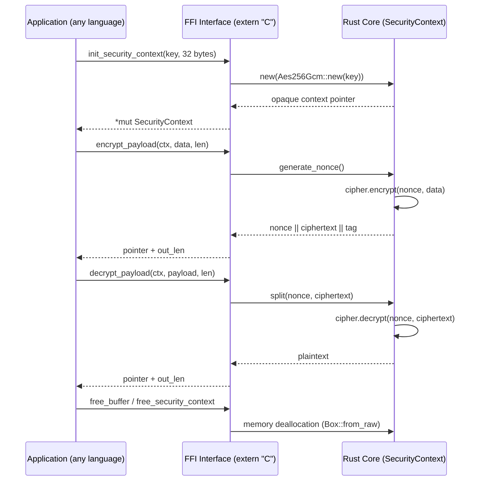
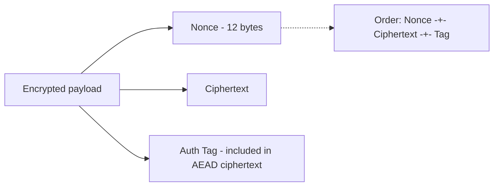
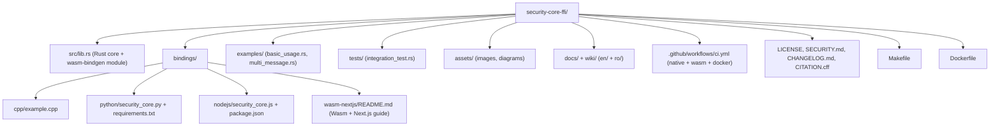

# Security Core FFI

🇷🇴 [Citește în Română](README.ro.md)

[](LICENSE)
[](https://www.rust-lang.org/)
[](.github/workflows/ci.yml)

**Cross-language Cryptographic Security Core, written in Rust and exposed via FFI (Foreign Function Interface).**

Original author / architect of the design and source code: **Ciprian Ștefan Pleșca**

---

## 1. Overview

Current release: **v0.3.1** — a tested, cross-language AES-256-GCM security core with native FFI, WebAssembly support, an official C header, Python and Node.js integration tests, and a reproducible CI pipeline.

`security-core-ffi` is an authenticated encryption module (AES-256-GCM) with key handling, written in **Rust** for memory safety, compiled into a dynamic library (`.so` / `.dll` / `.dylib`) and exposed through a stable `extern "C"` interface.

This core can be instantly integrated into **any** ecosystem — Python, C++, Node.js, WebAssembly/browser, Julia, Go, or any other language capable of calling C functions — without rewriting the security logic for each platform.

## 2. Rust → WebAssembly → Next.js

The security core can also be compiled as a **WebAssembly** module, to run directly in the browser (e.g. inside a Next.js application), without an intermediary server for client-side encryption/decryption operations.



Full details, including a React component example and `next.config.js` setup, in [`bindings/wasm-nextjs/README.md`](bindings/wasm-nextjs/README.md).

## 3. General architecture



## 4. Encryption flow (sequence)



## 5. Encrypted payload layout



## 6. Why Rust for the security core?

| Aspect | Benefit |
|---|---|
| **Memory isolation** | Rust prevents buffer overflows and use-after-free, vulnerabilities common in modules written in plain C |
| **Domain-agnostic** | The compiled library doesn't know whether it runs in automation, ML, or cloud infrastructure — it just receives bytes and returns secured bytes |
| **Native performance** | No interpretation overhead; runs at the processor's maximum speed |
| **FFI portability** | A single implementation, integrable into any language with C ABI support |

## 7. Rust example (the core)

```rust
#[no_mangle]
pub extern "C" fn init_security_context(key_ptr: *const c_uchar, key_len: size_t) -> *mut SecurityContext {
    if key_ptr.is_null() || key_len != 32 {
        return ptr::null_mut();
    }
    let key_slice = unsafe { slice::from_raw_parts(key_ptr, key_len) };
    let key = Key::<Aes256Gcm>::from_slice(key_slice);
    let cipher = Aes256Gcm::new(key);
    Box::into_raw(Box::new(SecurityContext { cipher }))
}
```

Full source code is in [`src/lib.rs`](src/lib.rs).

## 8. C++ example

The stable C ABI is declared in [`include/security_core.h`](include/security_core.h).
Include that header from C or C++ applications and link against the native library.

```cpp
extern "C" {
    struct SecurityContext;
    SecurityContext* init_security_context(const unsigned char* key, size_t key_len);
    unsigned char* encrypt_payload(SecurityContext* ctx, const unsigned char* data, size_t data_len, size_t* out_len);
    void free_security_context(SecurityContext* ctx);
}
```

See [`bindings/cpp/example.cpp`](bindings/cpp/example.cpp) for the full example.

## 9. Python example

```python
import ctypes, os
lib = ctypes.CDLL("./libsecurity_core.so")
lib.init_security_context.restype = ctypes.c_void_p
lib.encrypt_payload.restype = ctypes.POINTER(ctypes.c_ubyte)

key = os.urandom(32)
ctx = lib.init_security_context(key, len(key))
```

See [`bindings/python/security_core.py`](bindings/python/security_core.py) for a complete, object-oriented wrapper.

## 10. Installation and build

```bash
# Clone
git clone https://github.com/CiprianStefanPlesca/security-core-ffi.git
cd security-core-ffi

# Build the Rust core (native .so/.dll/.dylib library)
cargo build --release

# Build the WebAssembly module (for Next.js / browser)
cargo install wasm-pack   # one-time
wasm-pack build --target web --out-dir bindings/wasm-nextjs/pkg

# Run tests (unit + integration)
cargo test --release

# Run the included Rust examples
cargo run --example basic_usage
cargo run --example multi_message

# Build & run via Docker
docker build -t security-core-ffi .
docker run --rm security-core-ffi
```

### Centralized commands (Makefile)

All the commands above can also be run centrally via `make`:

```bash
make build-native    # cargo build --release
make build-wasm       # wasm-pack build --target web
make build-python     # prepare the Python environment
make build-nodejs     # npm install for the Node.js binding
make test             # cargo test --release
make examples         # run the examples in examples/
make all              # run everything above (except examples)
make clean            # clean up build artifacts
```

## 11. Repository structure



| Folder / File | Role |
|---|---|
| `src/lib.rs` | The security core (`extern "C"` FFI + `wasm-bindgen` module for `wasm32`) |
| `tests/integration_test.rs` | Integration tests (roundtrip, invalid key, corrupted data) |
| `examples/` | Standalone Rust programs demonstrating direct library usage |
| `bindings/cpp` | C++ consumption example |
| `bindings/python` | Installable Python wrapper (`ctypes`) + integration tests |
| `bindings/nodejs` | Node.js wrapper (`koffi`) + integration tests |
| `include/security_core.h` | Stable C/C++ ABI declarations |
| `fuzz/` | `cargo-fuzz` target for malformed decrypt payloads |
| `bindings/wasm-nextjs` | WebAssembly integration guide and example for Next.js |
| `assets/` | Images and diagrams used in the documentation |
| `wiki/en`, `wiki/ro` | Extended documentation (architecture, integration guide, API reference, FAQ) in English and Romanian |
| `.github/workflows/ci.yml` | CI: native build/test, Wasm build, Docker build |
| `Makefile` | Centralized build/test commands |

## 12. Release status and roadmap

- [x] WebAssembly (WASM) support for running in the browser / Next.js
- [x] Official C header and binding integration tests
- [x] FFI fuzz target for malformed decrypt payloads
- [x] Installable Python ctypes package metadata
- [x] Node.js binding tests and npm test script
- [x] CI checks for Rust, Node.js, Python ctypes, PyO3, and WASM
- [x] Automated PyPI wheel and npm WASM publication workflow (requires repository secrets)
- [ ] Key derivation (Argon2 / HKDF) integrated into the core
- [ ] Official Julia binding
- [ ] Automated fuzzing of the FFI interface (cargo-fuzz)
- [ ] npm package publication for `bindings/wasm-nextjs/pkg`

## 13. Security

See [SECURITY.md](SECURITY.md) for the vulnerability reporting policy.

## 14. License

This project is licensed under the [Apache License 2.0](LICENSE).

## 15. Citation

If you use this project in research or other works, please cite it according to [CITATION.cff](CITATION.cff).

## 16. Author

**Ciprian Ștefan Pleșca** — architect and author of the security core's design and original source code (Rust, C++, Python).
