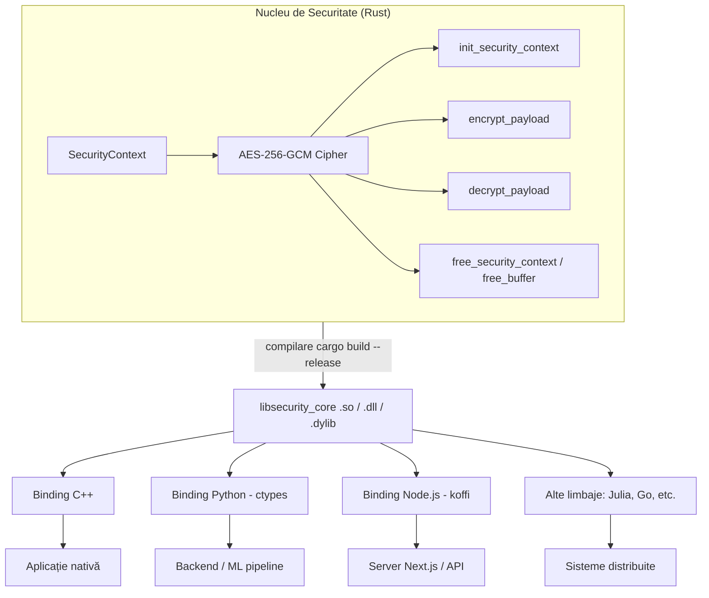
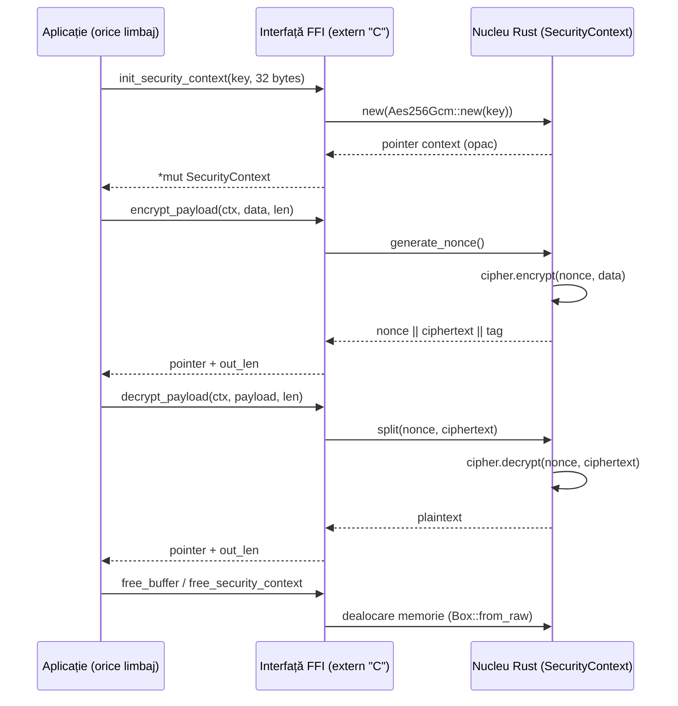
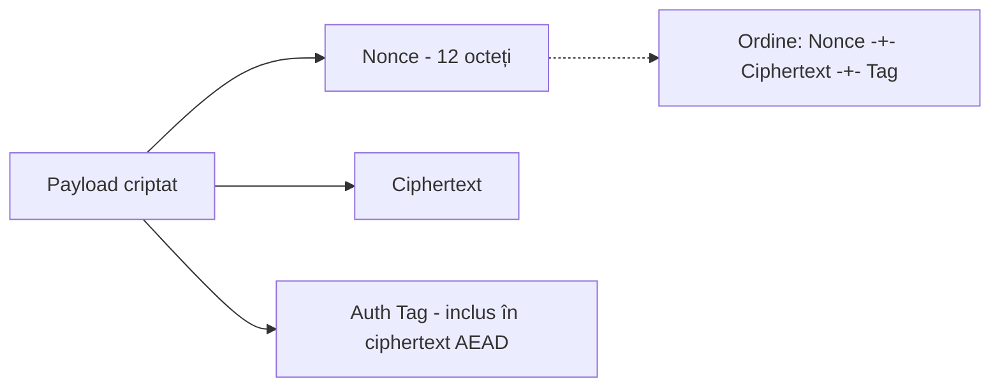
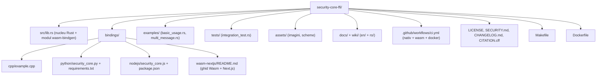

# Security Core FFI

🇬🇧 [Read in English](README.md)

[](LICENSE)
[](https://www.rust-lang.org/)
[](.github/workflows/ci.yml)

**Nucleu de Securitate Criptografic multi-limbaj, scris în Rust și expus prin FFI (Foreign Function Interface).**

Autor principal / conceptor al arhitecturii și codului sursă: **Ciprian Ștefan Pleșca**

---

## 1. Descriere

Versiunea publică actuală: **v0.3.13** — nucleu AES-256-GCM testat pentru integrare multi-limbaj, cu FFI nativ, suport WebAssembly, header C oficial, teste pentru Python și Node.js și CI reproductibil.

`security-core-ffi` este un modul de criptare autentificată (AES-256-GCM) și derivare de chei, scris în **Rust** pentru siguranța memoriei, compilat ca bibliotecă dinamică (`.so` / `.dll` / `.dylib`) și expus printr-o interfață `extern "C"` stabilă.

Acest nucleu poate fi integrat instant în **orice** ecosistem — Python, C++, Node.js, Julia, Go sau orice alt limbaj capabil să apeleze funcții C — fără a rescrie logica de securitate pentru fiecare platformă.

## 2. Rust → WebAssembly → Next.js

Nucleul de securitate poate fi compilat și ca modul **WebAssembly**, pentru a rula direct în browser (ex. într-o aplicație Next.js), fără server intermediar pentru operațiile de criptare/decriptare client-side.


Detalii complete, inclusiv exemplu de componentă React și configurare `next.config.js`, în [`bindings/wasm-nextjs/README.ro.md`](bindings/wasm-nextjs/README.ro.md).

## 3. Arhitectură generală



## 4. Fluxul de criptare (secvență)



## 5. Structura payload-ului criptat



## 6. De ce Rust pentru nucleul de securitate?

| Aspect | Beneficiu |
|---|---|
| **Izolarea memoriei** | Rust previne buffer overflow și use-after-free, vulnerabilități comune în module scrise în C pur |
| **Agnostic față de domeniu** | Biblioteca compilată nu știe dacă rulează în automatizare, ML sau infrastructură cloud — primește octeți, returnează octeți securizați |
| **Performanță nativă** | Fără overhead de interpretare; execuție la viteza maximă a procesorului |
| **Portabilitate FFI** | O singură implementare, integrabilă în orice limbaj cu suport C ABI |

## 7. Exemplu Rust (nucleul)

```rust
#[no_mangle]
pub extern "C" fn init_security_context(key_ptr: *const c_uchar, key_len: size_t) -> *mut SecurityContext {
    if key_ptr.is_null() || key_len != 32 {
        return ptr::null_mut();
    }
    let key_slice = unsafe { slice::from_raw_parts(key_ptr, key_len) };
    let key = Key::<Aes256Gcm>::from_slice(key_slice);
    let cipher = Aes256Gcm::new(key);
    Box::into_raw(Box::new(SecurityContext { cipher }))
}
```

Codul complet se află în [`src/lib.rs`](src/lib.rs).

## 8. Exemplu C++

ABI-ul C stabil este declarat în [`include/security_core.h`](include/security_core.h).
Include acest header în aplicațiile C/C++ și leagă biblioteca nativă compilată.

```cpp
extern "C" {
    struct SecurityContext;
    SecurityContext* init_security_context(const unsigned char* key, size_t key_len);
    unsigned char* encrypt_payload(SecurityContext* ctx, const unsigned char* data, size_t data_len, size_t* out_len);
    void free_security_context(SecurityContext* ctx);
}
```

Vezi [`bindings/cpp/example.cpp`](bindings/cpp/example.cpp) pentru exemplul complet.

## 9. Exemplu Python

```python
import ctypes, os
lib = ctypes.CDLL("./libsecurity_core.so")
lib.init_security_context.restype = ctypes.c_void_p
lib.encrypt_payload.restype = ctypes.POINTER(ctypes.c_ubyte)

cheie = os.urandom(32)
ctx = lib.init_security_context(cheie, len(cheie))
```

Vezi [`bindings/python/security_core.py`](bindings/python/security_core.py) pentru un wrapper complet, orientat obiect.

## 10. Instalare și build

```bash
# Clonare
git clone https://github.com/Ciprian-LocalPulse/secure-core-ffi.git
cd security-core-ffi

# Build nucleu Rust (biblioteca nativa .so/.dll/.dylib)
cargo build --release

# Build modul WebAssembly (pentru Next.js / browser)
cargo install wasm-pack   # o singura data
wasm-pack build --target web --out-dir bindings/wasm-nextjs/pkg

# Rulare teste (unitare + integrare)
cargo test --release

# Rulare exemple Rust incluse
cargo run --example basic_usage
cargo run --example multi_message

# Build & rulare via Docker
docker build -t security-core-ffi .
docker run --rm security-core-ffi
```

### Comenzi centralizate (Makefile)

Toate comenzile de mai sus pot fi rulate și centralizat, prin `make`:

```bash
make build-native   # cargo build --release
make build-wasm      # wasm-pack build --target web
make build-python    # pregatire mediu Python
make build-nodejs    # npm install pentru binding-ul Node.js
make test            # cargo test --release
make examples        # ruleaza exemplele din examples/
make all             # ruleaza tot ce e de mai sus (mai putin examples)
make clean           # curata artefactele de build
```

## 11. Structura repository-ului



| Folder / Fișier | Rol |
|---|---|
| `src/lib.rs` | Nucleul de securitate (FFI `extern "C"` + modul `wasm-bindgen` pentru `wasm32`) |
| `tests/integration_test.rs` | Teste de integrare (roundtrip, cheie invalidă, date corupte) |
| `examples/` | Programe Rust independente ce demonstrează utilizarea directă a bibliotecii |
| `bindings/cpp` | Exemplu de consum din C++ |
| `bindings/python` | Wrapper Python instalabil (`ctypes`) + teste de integrare |
| `bindings/nodejs` | Wrapper Node.js (`koffi`) + teste de integrare |
| `include/security_core.h` | Declarații ABI C/C++ stabile |
| `fuzz/` | Țintă `cargo-fuzz` pentru payload-uri de decriptare malformate |
| `bindings/wasm-nextjs` | Ghid și exemplu de integrare WebAssembly în Next.js |
| `assets/` | Imagini și scheme folosite în documentație |
| `wiki/en`, `wiki/ro` | Documentație extinsă (arhitectură, ghid de integrare, referință API, FAQ) în engleză și română |
| `.github/workflows/ci.yml` | CI: build/test nativ, build Wasm, build Docker |
| `Makefile` | Comenzi centralizate de build/test |

## 12. Statusul release-ului și roadmap

- [x] Suport WebAssembly (WASM) pentru rulare în browser / Next.js
- [x] Header C oficial și teste pentru binding-uri
- [x] CI pentru Rust, Node.js, Python ctypes, PyO3 și WASM
- [x] Workflow automat pentru publicarea wheel-urilor PyPI și a pachetului npm WASM (necesită secrete în repository)
- [ ] Derivare de chei (Argon2 / HKDF) integrată în nucleu
- [ ] Binding oficial Julia
- [ ] Fuzzing automat al interfeței FFI (cargo-fuzz)
- [ ] Publicare pachet npm pentru `bindings/wasm-nextjs/pkg`

## 13. Securitate

Consultă [SECURITY.md](SECURITY.md) pentru politica de raportare a vulnerabilităților.

## 14. Licență

Acest proiect este licențiat sub [Apache License 2.0](LICENSE).

## 15. Citare

Dacă folosești acest proiect în cercetare sau alte lucrări, te rugăm să citezi conform [CITATION.cff](CITATION.cff).

## 16. Autor

**Ciprian Ștefan Pleșca** — conceptor și autor al arhitecturii nucleului de securitate și al codului sursă original (Rust, C++, Python).
