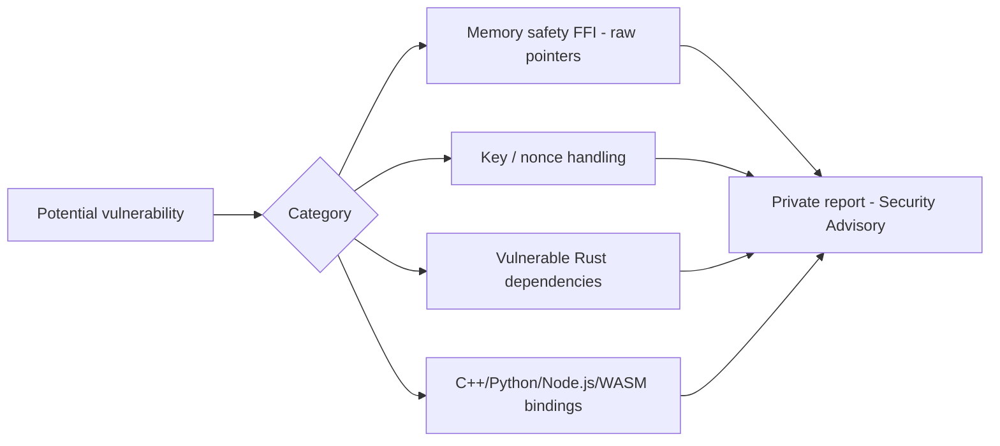

# Security Policy

🇷🇴 [Citește în Română](SECURITY.ro.md)

## Supported versions

| Version | Supported |
|----------|-----------|
| 0.3.x    | ✅ |
| 0.2.x    | ✅ |
| 0.1.x    | ❌ |
| < 0.1    | ❌ |

## Reporting a vulnerability

If you discover a vulnerability in `security-core-ffi` (the Rust core, the C++/Python/Node.js/WebAssembly bindings, or the Docker/CI infrastructure), please **do not open a public issue**.

Instead:

1. Submit a private report via **GitHub Security Advisories** ("Report a vulnerability" in the repository's Security tab).
2. Include:
   - a description of the vulnerability and its potential impact;
   - reproduction steps (minimal code, if possible);
   - the affected version (commit hash or tag).
3. You will receive an acknowledgment within **72 hours**.
4. We will work with you on a remediation plan and, if applicable, on coordinated disclosure.

## Relevant security domains

## Best practices already applied in the code

- Cryptographic keys have a fixed, validated length (32 bytes / 256 bits) before use.
- Nonces are generated with a CSPRNG (`OsRng`) for every encryption operation — never reused.
- All sensitive logic is isolated in Rust (`#![no_mangle]` + `extern "C"`), minimizing the attack surface from consuming languages.
- Dynamically allocated memory is explicitly freed via `free_buffer` / `free_security_context`, avoiding `use-after-free` by design (owned pointers, `Box::into_raw` / `Box::from_raw`).

## Known limitations

- The FFI interface exposes raw pointers; consumers in other languages **must** honor the call contract (correct lengths, memory freeing), otherwise they can introduce vulnerabilities in their own layer.
- Key management and rotation remain the responsibility of the application integrating the library.
- This project has not undergone an independent cryptographic audit. Treat the library as a focused authenticated-encryption primitive, not as a complete security or compliance product.
- Before production use, consumers should complete an application-specific threat model, dependency review, fuzzing campaign, and operational incident-response plan.
