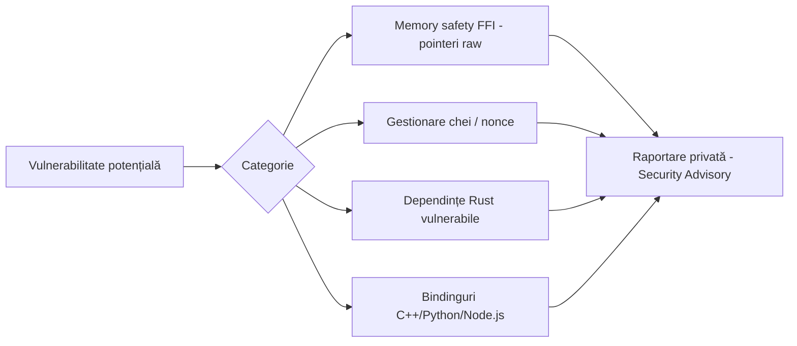

# Politica de Securitate

🇬🇧 [Read in English](SECURITY.md)

## Versiuni suportate

| Versiune | Suportată |
|----------|-----------|
| 0.3.x    | ✅ |
| 0.2.x    | ✅ |
| 0.1.x    | ❌ |
| < 0.1    | ❌ |

## Raportarea unei vulnerabilități

Dacă descoperi o vulnerabilitate în `security-core-ffi` (nucleul Rust, bindingurile C++/Python/Node.js sau infrastructura Docker/CI), te rugăm **să nu deschizi un issue public**.

În schimb:

1. Trimite un raport privat prin **GitHub Security Advisories** ("Report a vulnerability" din tab-ul Security al repository-ului).
2. Include:
   - o descriere a vulnerabilității și a impactului potențial;
   - pași de reproducere (cod minimal, dacă este posibil);
   - versiunea afectată (commit hash sau tag).
3. Vei primi o confirmare de primire în cel mult **72 de ore**.
4. Vom colabora cu tine la un plan de remediere și, dacă e cazul, la o divulgare coordonată (coordinated disclosure).

## Domenii de securitate relevante

## Bune practici deja aplicate în cod

- Cheile criptografice au lungime fixă validată (32 octeți / 256 biți) înainte de utilizare.
- Nonce-urile sunt generate cu un CSPRNG (`OsRng`) pentru fiecare operație de criptare — niciodată reutilizate.
- Toată logica sensibilă este izolată în Rust (`#![no_mangle]` + `extern "C"`), minimizând suprafața de atac din limbajele consumatoare.
- Memoria alocată dinamic este eliberată explicit prin `free_buffer` / `free_security_context`, evitând `use-after-free` prin design (owned pointers, `Box::into_raw` / `Box::from_raw`).

## Limitări cunoscute

- Interfața FFI expune pointeri raw; consumatorii din alte limbaje **trebuie** să respecte contractul de apel (lungimi corecte, eliberare memorie), altfel pot introduce vulnerabilități în stratul lor propriu.
- Gestionarea și rotația cheilor rămân responsabilitatea aplicației care integrează biblioteca.
- Proiectul nu a trecut printr-un audit criptografic independent. Biblioteca trebuie tratată ca o primitivă de criptare autentificată, nu ca un produs complet de securitate sau conformitate.
- Înainte de utilizarea în producție, consumatorii trebuie să realizeze un model de amenințări specific aplicației, revizuirea dependențelor, fuzzing și un plan operațional de răspuns la incidente.
