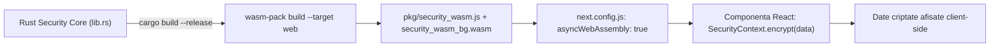

# Integrare WebAssembly în Next.js

🇬🇧 [Read in English](README.md)


Acest folder documentează pasul `Rust -> Wasm -> Next.js` ilustrat în `assets/rust-wasm-integration-guide.jpg`.

## 1. Build Wasm

```bash
cargo install wasm-pack   # o singura data
wasm-pack build --target web --out-dir bindings/wasm-nextjs/pkg
```

Rezultă folderul `pkg/` cu `security_wasm.js` și `security_wasm_bg.wasm`.

## 2. Configurare `next.config.js`

```javascript
/** @type {import('next').NextConfig} */
const nextConfig = {
  experiments: {
    asyncWebAssembly: true,
  },
};

module.exports = nextConfig;
```

## 3. Componentă React de exemplu (`components/SecureComponent.jsx`)

```javascript
"use client";
import { useEffect, useState } from "react";

export default function SecureComponent({ data }) {
  const [encrypted, setEncrypted] = useState(null);

  useEffect(() => {
    const runSecure = async () => {
      const wasm = await import("../bindings/wasm-nextjs/pkg/security_wasm");
      await wasm.default(); // inițializează modulul Wasm

      const key = crypto.getRandomValues(new Uint8Array(32));
      const ctx = new wasm.SecurityContext(key);

      const encoded = new TextEncoder().encode(data);
      const encryptedBytes = ctx.encrypt(encoded);

      setEncrypted(Buffer.from(encryptedBytes).toString("hex"));
    };

    runSecure();
  }, [data]);

  return (
    <div>
      <h3>Secure Component</h3>
      <p>encrypted data</p>
      <code>{encrypted}</code>
    </div>
  );
}
```

## 4. Diagrama fluxului (Rust -> Wasm -> Next.js)



Vezi imaginea completă în [`../../assets/rust-wasm-integration-guide.jpg`](../../assets/rust-wasm-integration-guide.jpg).
