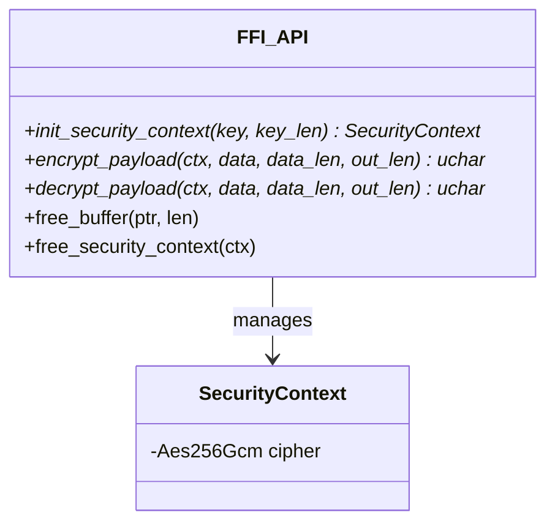
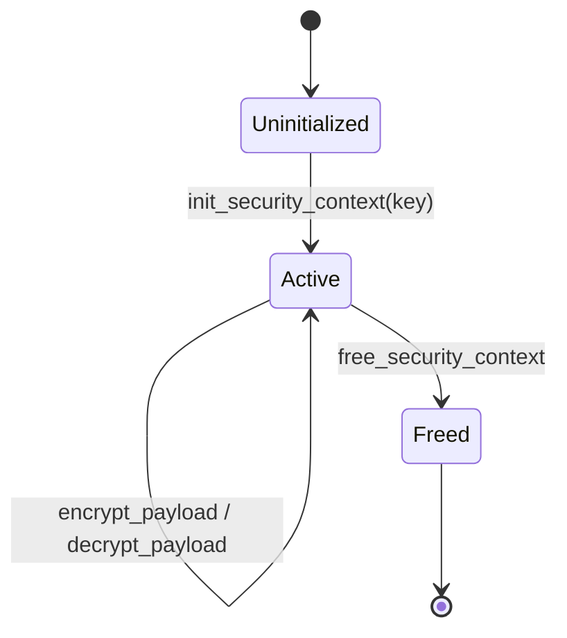
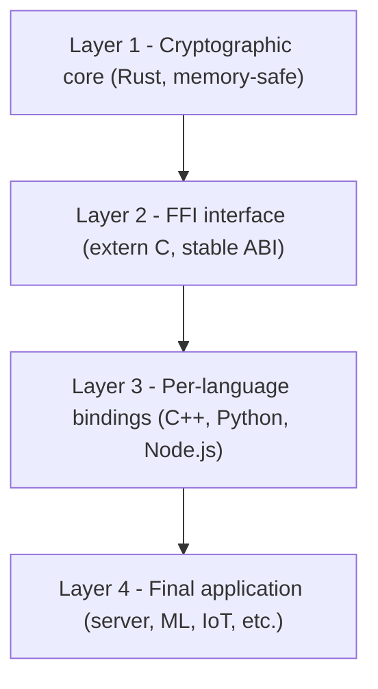

# Architecture

*Author: Ciprian Ștefan Pleșca*

## 1. Context and the problem being solved

When a team needs authenticated encryption across several components written in different languages — a backend service in Python, a desktop client in C++, a web frontend in Node.js — two solutions typically emerge, both problematic:

1. **Reimplementing** the encryption logic in each language, using whatever native library is available there. The risk: each implementation can differ subtly (different nonce handling, different tag verification), and bugs introduced independently only become visible once the components stop being able to talk to each other.
2. **Delegating cryptography to the protocol layer** (e.g. TLS), which solves transport but not the cases where data must be encrypted *at rest* (files, database records, queued messages) or before crossing an untrusted channel.

`security-core-ffi` addresses the first problem: the encryption logic exists in a single place, written once, tested once, and every other language consumes it through a stable contract.

## 2. Design principle

The security core is fully isolated from the consuming language. The contract between Rust and the rest of the world consists of five `extern "C"` functions, each operating on raw pointers and explicit lengths (C ABI style) — a deliberate choice, since a C-style ABI is the one common denominator that nearly every modern language knows how to link against (via `ctypes` in Python, `dlopen`/static linking in C++, or `koffi` in Node.js).

The minimal API surface (five functions) is intentional: the smaller the contract, the easier it is to audit, and the lower the probability that a binding will misuse it.

## 3. Threat model

It is worth being explicit about which risks this design addresses and which risks remain, by construction, out of scope.

**In scope for the core:**
- Confidentiality and integrity of encrypted data, as long as the key is not compromised (properties guaranteed by AES-256-GCM as an AEAD scheme).
- Preventing accidental nonce reuse, through automatic, cryptographically random nonce generation on every call.
- Eliminating classes of memory bugs (use-after-free, double-free, buffer overflow) in the encryption implementation itself, via Rust's compiler guarantees.

**Out of scope for the core (the integrating application's responsibility):**
- Key generation, derivation, and rotation. The core receives an already-prepared 32-byte key; it does not decide where it comes from or how often it changes.
- Management of the channel through which the key reaches the application (environment variable, HSM, KMS, etc.).
- Correctness of calls at the FFI boundary from the consuming language — a poorly written binding can still introduce memory bugs *on its own side*, even though the Rust core remains safe.

This explicit boundary matters: much of the criticism aimed at cryptographic libraries stems from confusing "what the library guarantees" with "what the system using it guarantees."

## 4. Lifecycle of a context

A context (`SecurityContext`) is created once, from a validated key, and stays active for as long as needed — typically the lifetime of a connection session, the lifetime of a process, or the duration of a file operation. The lifecycle is intentionally simple (three states), precisely to reduce the number of ways it can be misused from a language without automatic memory management.

## 5. System layers

Each layer has a single responsibility, which makes it possible to replace or extend any of them independently:

- **Layer 1** contains all the sensitive logic — and only that. It depends on no layer above it.
- **Layer 2** is the stable contract; changing it implies a major version bump for the library.
- **Layer 3** can grow at any time (a new binding for a new language) without touching the core.
- **Layer 4** is the responsibility of the team integrating the library.

## 6. Implementation notes

- The key is strictly validated at 32 bytes (AES-256) before the cipher is constructed; any other length is rejected at `init_security_context`.
- Every encryption generates a fresh 12-byte nonce via `OsRng` (the operating system's cryptographic generator), prepended to the ciphertext — the integrating application never needs to manage nonces manually.
- The AEAD (GCM) mode automatically produces a 16-byte authentication tag, included in the resulting ciphertext; any modification of the encrypted data (accidental or adversarial) causes decryption to fail explicitly, rather than silently producing corrupted data.
- Ownership of the returned buffers is transferred to the caller (`Box::into_raw` / `mem::forget`), which is why every buffer *must* be explicitly freed via `free_buffer`, and the context via `free_security_context` — see the [API Reference](API-Reference.md) for details and the consequences of skipping this step.

## 7. Known limitations and future directions

This documentation would not be complete without an honest discussion of current limits:

- There is no internal key derivation mechanism yet (e.g. Argon2 or HKDF) — see the [FAQ](FAQ.md) for details and roadmap status.
- WebAssembly is supported as a compilation target and published as the `secure-core-ffi-wasm` npm package. Browser-side keys remain exposed to the client environment; see [Key Management Guidance](Key-Management.md).
- Automatic key rotation is not handled by the core and remains, deliberately, the application's responsibility — a design choice discussed in the threat model section above, not an accidental omission.

---

[Home](Home.md) · [Architecture](Architecture.md) · [Integration Guide](Integration-Guide.md) · [API Reference](API-Reference.md) · [Threat Model](Threat-Model.md) · [FAQ](FAQ.md) · [Author](Author.md)

<b>security-core-ffi</b> — architecture &amp; documentation by <a href="Author.md"><b>Ciprian Ștefan Pleșca</b></a> 
Independent researcher · <a href="mailto:contact@agentflow-enterprise.com">contact@agentflow-enterprise.com</a>

Found an issue in the documentation? Open a discussion or contact the author directly. 
To report a security vulnerability, use <b>SECURITY.md</b> via GitHub Security Advisories — not this contact address.

© 2026 Ciprian Ștefan Pleșca. Documentation maintained alongside the <code>security-core-ffi</code> project.

