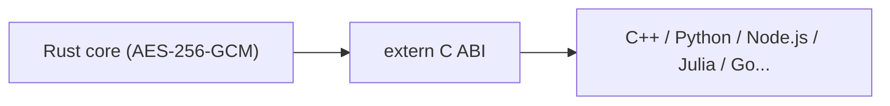

# Wiki — Security Core FFI

*[Română](../ro/Home.md) · English*

## A note on this edition

This document reworks and extends the technical documentation of the **security-core-ffi** project, organizing it along the lines of an applied research write-up: context and motivation, threat model, formal architecture, integration protocol, and a critical discussion of limitations. The goal is twofold — to stay useful to an engineer who wants to integrate the library into a real system, and to rigorously document the design decisions so that they can be verified, challenged, or extended by anyone else.

**Author and architecture/code designer:** [Ciprian Ștefan Pleșca](Author.md)
**Contact:** contact@agentflow-enterprise.com

## Table of contents

- [About the author](Author.md)
- [Architecture](Architecture.md)
- [Integration guide (C++, Python, Node.js)](Integration-Guide.md)
- [FFI API reference](API-Reference.md)
- [Threat model](Threat-Model.md)
- [Key-management guidance](Key-Management.md)
- [Compatibility policy](Compatibility.md)
- [Release integrity](Release-Integrity.md)
- [Release readiness](Release-Readiness.md)
- [Frequently asked questions (FAQ)](FAQ.md)

## Summary

`security-core-ffi` is an authenticated encryption core (AES-256-GCM), written in Rust for memory safety and exposed through a stable C interface (FFI). The core idea is easy to state but hard to get right in practice: security logic — nonce generation, authentication tag verification, key handling in memory — must be written *once*, in a language that eliminates by construction the classes of bugs that most often plague hand-written cryptographic code (buffer overflow, use-after-free, data races). Every other language in the ecosystem (C++, Python, Node.js, and in principle any language that can link a C dynamic library) consumes this core through a stable contract, without reimplementing any of the sensitive parts.

This separation — a minimal trusted core plus interchangeable consumer layers — is also why the project is organized into four layers, detailed on the [Architecture](Architecture.md) page.

## Why this project matters

Most critical vulnerabilities in cryptographic libraries do not come from picking the wrong algorithm, but from how it is implemented: a nonce accidentally reused, a buffer freed twice, a key that stays in memory longer than it should. `security-core-ffi` moves these responsibilities into a language (Rust) that treats them as compile-time errors or runtime-checked invariants, instead of leaving them to the discretion of each binding.

## How to read this documentation

1. Anyone who just wants to integrate the library quickly can jump straight to the [Integration Guide](Integration-Guide.md).
2. Anyone who wants to understand *why* the API looks the way it does should read [Architecture](Architecture.md) first, where the threat model and design decisions are discussed.
3. The [API Reference](API-Reference.md) is the quick-lookup document to consult function by function during development.
4. The [FAQ](FAQ.md) collects the questions that come up consistently from people integrating the library for the first time.

---

[Home](Home.md) · [Architecture](Architecture.md) · [Integration Guide](Integration-Guide.md) · [API Reference](API-Reference.md) · [Threat Model](Threat-Model.md) · [FAQ](FAQ.md) · [Author](Author.md)

<b>security-core-ffi</b> — architecture &amp; documentation by <a href="Author.md"><b>Ciprian Ștefan Pleșca</b></a> 
Independent researcher · <a href="mailto:contact@agentflow-enterprise.com">contact@agentflow-enterprise.com</a>

Found an issue in the documentation? Open a discussion or contact the author directly. 
To report a security vulnerability, use <b>SECURITY.md</b> via GitHub Security Advisories — not this contact address.

© 2026 Ciprian Ștefan Pleșca. Documentation maintained alongside the <code>security-core-ffi</code> project.

