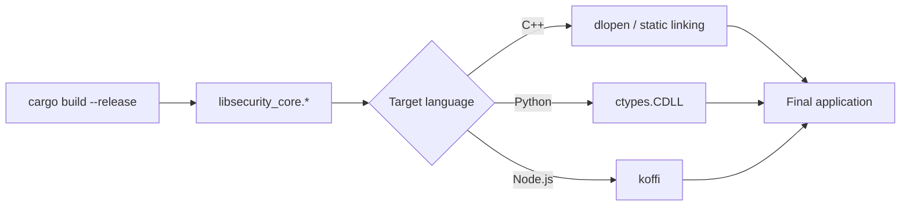

# Integration Guide

*Author: Ciprian Ștefan Pleșca*

This guide assumes basic familiarity with the target language and aims to cover not just "how to compile," but the reasoning behind each step, so that a broken integration is easy to diagnose.

## 1. Building the core

```bash
cargo build --release
```

The output is found in `target/release/`:
- Linux: `libsecurity_core.so`
- macOS: `libsecurity_core.dylib`
- Windows: `security_core.dll`

Recommendation: always build in `--release` mode for real integrations. Rust's `debug` builds include extra checks (overflow checks) that are useful during development but come with a performance cost you don't want to pay in production, especially for a core that's called frequently.

## 2. Integrating with C++

```cpp
extern "C" {
    struct SecurityContext;
    SecurityContext* init_security_context(const unsigned char* key, size_t key_len);
    unsigned char* encrypt_payload(SecurityContext* ctx, const unsigned char* data, size_t data_len, size_t* out_len);
    unsigned char* decrypt_payload(SecurityContext* ctx, const unsigned char* data, size_t data_len, size_t* out_len);
    void free_buffer(unsigned char* ptr, size_t len);
    void free_security_context(SecurityContext* ctx);
}
```

Compiling & linking:

```bash
g++ bindings/cpp/example.cpp -L target/release -lsecurity_core -o example
LD_LIBRARY_PATH=target/release ./example
```

Critical point for C++: `SecurityContext` is an opaque type (forward-declared, no body). C++ code must never try to access its fields directly or allocate it on the stack — it is created exclusively by `init_security_context` and freed exclusively by `free_security_context`. Any other manipulation of the pointer is undefined behavior.

## 3. Integrating with Python

```python
from bindings.python.security_core import SecurityCore
import os

key = os.urandom(32)
core = SecurityCore(key)
enc = core.encrypt(b"sensitive data")
dec = core.decrypt(enc)
```

Under the hood, the Python binding uses `ctypes.CDLL` to link the dynamic library and exposes an object-oriented wrapper, so Python developers never have to manipulate raw pointers or buffer lengths directly — the wrapper calls `free_buffer` automatically at the right time (e.g. in a destructor or via a context manager), removing the main risk of misusing the C API.

## 4. Integrating with Node.js

```javascript
const { SecurityCore } = require("security-core-ffi-nodejs-binding");
const crypto = require("crypto");

const key = crypto.randomBytes(32);
const core = new SecurityCore(key);
const enc = core.encrypt(Buffer.from("sensitive data"));
const dec = core.decrypt(enc);
```

The Node.js binding uses `koffi` to load the native library. Set `SECURITY_CORE_LIB` to the absolute path of the matching platform library when the default development path is unsuitable. Call `core.close()` exactly once when the context is no longer needed; native contexts are not managed by V8's garbage collector.

## 5. Common integration errors

| Symptom | Likely cause | Fix |
|---|---|---|
| `init_security_context` returns `NULL` | Key is not exactly 32 bytes | Check key length before the call |
| `decrypt_payload` returns `NULL` | Corrupted data, wrong key, or truncated payload | Verify the integrity of the transmitted/stored data |
| Steadily growing memory usage | Buffers returned by `encrypt_payload`/`decrypt_payload` not freed | Call `free_buffer` for every buffer received |
| Crash when freeing the context | `free_security_context` called twice on the same pointer | Set the pointer to `NULL` after freeing and check before calling again |

## 6. Integration flow diagram



## 7. Testing recommendation

Regardless of the integration language, a minimal round-trip test is recommended (encryption immediately followed by decryption, verifying the original text is recovered identically) run on every build, plus a negative test (flipping a single byte in the ciphertext and verifying that `decrypt_payload` fails, rather than silently producing a wrong result). This second test validates exactly the authentication property provided by GCM mode, discussed in [Architecture](Architecture.md).

---

<div align="center">
<sub>

[Home](Home.md) · [Architecture](Architecture.md) · [Integration Guide](Integration-Guide.md) · [API Reference](API-Reference.md) · [Threat Model](Threat-Model.md) · [FAQ](FAQ.md) · [Author](Author.md)

</sub>


<sub>
<b>security-core-ffi</b> — architecture &amp; documentation by <a href="Author.md"><b>Ciprian Ștefan Pleșca</b></a><br/>
Independent researcher · <a href="mailto:contact@agentflow-enterprise.com">contact@agentflow-enterprise.com</a>
</sub>

<sub>
Found an issue in the documentation? Open a discussion or contact the author directly.<br/>
To report a security vulnerability, use <b>SECURITY.md</b> via GitHub Security Advisories — not this contact address.
</sub>

<sub>© 2026 Ciprian Ștefan Pleșca. Documentation maintained alongside the <code>security-core-ffi</code> project.</sub>

</div>
