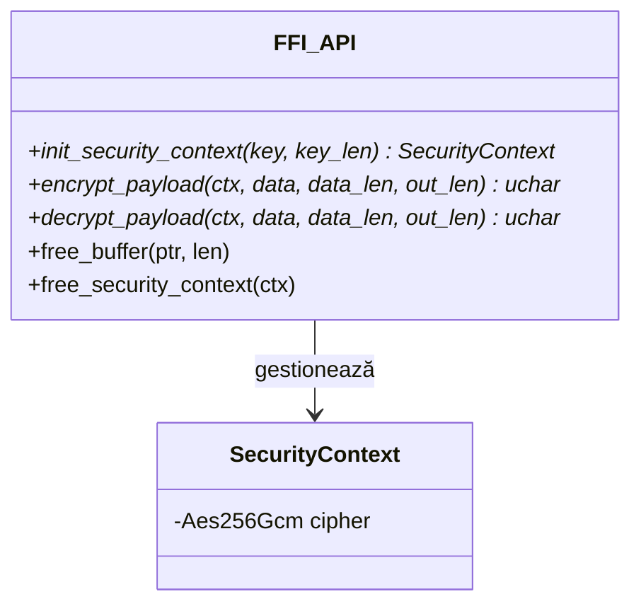
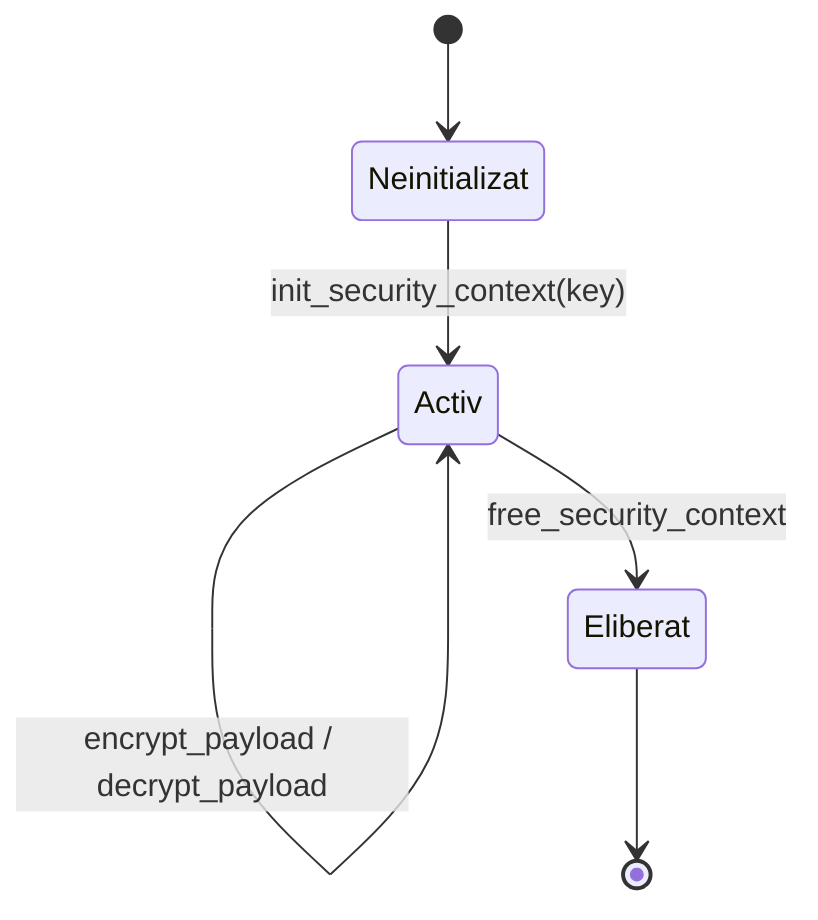
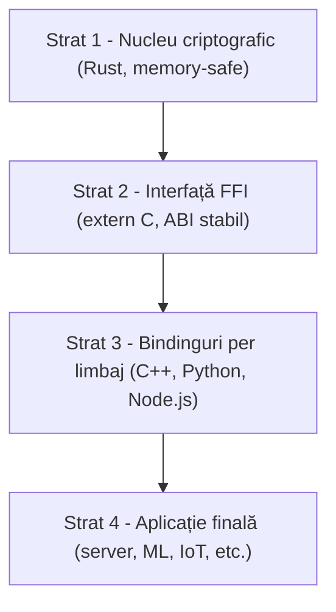

# Arhitectură

*Autor: Ciprian Ștefan Pleșca*

## 1. Context și problema de rezolvat

Când o echipă are nevoie de criptare autentificată în mai multe componente scrise în limbaje diferite — un serviciu backend în Python, un client desktop în C++, o interfață web în Node.js — apar de obicei două soluții, ambele problematice:

1. **Reimplementarea** logicii de criptare în fiecare limbaj, folosind biblioteca nativă disponibilă acolo. Riscul: fiecare implementare poate diferi subtil (gestionare diferită a nonce-ului, verificare diferită a tag-ului), iar bug-urile introduse independent nu sunt vizibile decât atunci când componentele nu mai comunică între ele.
2. **Delegarea criptografiei la nivel de protocol** (de exemplu TLS), care rezolvă transportul, dar nu și cazurile în care datele trebuie criptate *la repaus* (fișiere, înregistrări în bază de date, mesaje puse în coadă) sau înainte de a traversa un canal necontrolat.

`security-core-ffi` răspunde primei probleme: logica de criptare există într-un singur loc, scrisă o singură dată, testată o singură dată, iar restul limbajelor o consumă printr-un contract stabil.

## 2. Principiu de design

Nucleul de securitate este izolat complet de limbajul consumator. Contractul dintre Rust și restul lumii este format din cinci funcții `extern "C"`, fiecare operând pe pointeri raw și lungimi explicite (stil C ABI) — alegere deliberată, pentru că un ABI de tip C este singurul numitor comun pe care aproape orice limbaj modern știe să îl lege (prin `ctypes` în Python, `dlopen`/linking static în C++, `ffi-napi` sau `N-API` în Node.js).

Suprafața minimală a API-ului (cinci funcții) este intenționată: cu cât contractul e mai mic, cu atât e mai ușor de auditat și cu atât scade probabilitatea ca un binding să-l folosească greșit.

## 3. Model de amenințare

Este util să fie explicit ce riscuri adresează acest design și ce riscuri rămân, prin construcție, în afara scopului său.

**În scopul nucleului:**
- Confidențialitatea și integritatea datelor criptate, atâta timp cât cheia nu este compromisă (proprietăți garantate de AES-256-GCM ca schemă AEAD).
- Prevenirea reutilizării accidentale a unui nonce, prin generarea lui automată și criptografic aleatoare la fiecare apel.
- Eliminarea claselor de bug-uri de memorie (use-after-free, double-free, buffer overflow) în implementarea propriu-zisă a criptării, prin garanțiile compilatorului Rust.

**În afara scopului nucleului (responsabilitatea aplicației care îl integrează):**
- Generarea, derivarea și rotația cheii. Nucleul primește o cheie deja pregătită de 32 de octeți; nu decide de unde vine sau cât de des se schimbă.
- Managementul canalului prin care cheia ajunge la aplicație (variabilă de mediu, HSM, KMS etc.).
- Corectitudinea apelurilor la granița FFI din partea limbajului consumator — un binding scris greșit poate în continuare introduce bug-uri de memorie *în partea lui*, chiar dacă nucleul Rust rămâne sigur.

Această delimitare explicită contează: multe critici aduse bibliotecilor de criptografie provin din confuzia între „ce garantează biblioteca” și „ce garantează sistemul care o folosește”.

## 4. Ciclul de viață al unui context

Un context (`SecurityContext`) este creat o dată, dintr-o cheie validată, și rămâne activ pe toată durata de viață pentru care este necesar — de obicei sesiunea unei conexiuni, durata de viață a unui proces, sau durata unei operațiuni pe un fișier. Ciclul de viață este intenționat simplu (trei stări), tocmai ca să reducă numărul de moduri în care poate fi folosit greșit dintr-un limbaj fără gestionare automată a memoriei.

## 5. Straturi ale sistemului

Fiecare strat are o singură responsabilitate, ceea ce face posibilă înlocuirea sau extinderea independentă a oricăruia dintre ele:

- **Stratul 1** conține toată logica sensibilă — și doar pe aceasta. Nu depinde de niciun strat superior.
- **Stratul 2** este contractul stabil; schimbarea lui implică o schimbare de versiune majoră a bibliotecii.
- **Stratul 3** poate crește oricând (un binding nou pentru un limbaj nou) fără să atingă nucleul.
- **Stratul 4** este responsabilitatea echipei care integrează biblioteca.

## 6. Note de implementare

- Cheia este validată strict la 32 de octeți (AES-256) înainte de a construi cipher-ul; orice altă lungime este respinsă la `init_security_context`.
- Fiecare criptare generează un nonce nou de 12 octeți prin `OsRng` (generator criptografic al sistemului de operare), prepended la ciphertext — aplicația care integrează biblioteca nu trebuie să gestioneze niciodată manual nonce-uri.
- Modul AEAD (GCM) produce automat un tag de autentificare de 16 octeți, inclus în ciphertext-ul rezultat; orice modificare a datelor criptate (accidentală sau adversarială) face ca decriptarea să eșueze explicit, în loc să producă tăcut date corupte.
- Memoria buffer-elor returnate este predată prin „ownership transfer” către apelant (`Box::into_raw` / `mem::forget`), motiv pentru care fiecare buffer *trebuie* eliberat explicit prin `free_buffer`, respectiv `free_security_context` pentru context — vezi [Referința API](Referinta-API.md) pentru detalii și consecințele omiterii acestui pas.

## 7. Limitări cunoscute și direcții viitoare

Documentația nu ar fi completă fără o discuție onestă a limitelor actuale:

- Nu există încă un mecanism intern de derivare a cheii (de exemplu Argon2 sau HKDF) — vezi [FAQ](FAQ.md) pentru detalii și starea din roadmap.
- Suportul pentru compilare țintă WebAssembly este planificat, dar nu este disponibil în versiunea curentă.
- Rotația automată a cheilor nu este gestionată de nucleu și rămâne, deliberat, responsabilitatea aplicației — o alegere de design discutată în secțiunea de model de amenințare de mai sus, nu o omisiune accidentală.

---

[Home](Home.md) · [Arhitectură](Arhitectura.md) · [Ghid de Integrare](Ghid-de-Integrare.md) · [Referință API](Referinta-API.md) · [FAQ](FAQ.md) · [Autor](Autor.md)

<b>security-core-ffi</b> — arhitectură &amp; documentație de <a href="Autor.md"><b>Ciprian Ștefan Pleșca</b></a> 
Cercetător independent · <a href="mailto:contact@agentflow-enterprise.com">contact@agentflow-enterprise.com</a>

Ai găsit o problemă în documentație? Deschide o discuție sau contactează direct autorul. 
Pentru raportarea unei vulnerabilități de securitate, folosește <b>SECURITY.md</b> prin GitHub Security Advisories — nu această adresă de contact.

© 2026 Ciprian Ștefan Pleșca. Documentație menținută alături de proiectul <code>security-core-ffi</code>.

