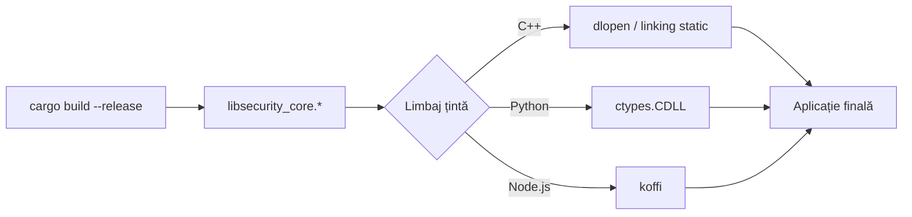

# Ghid de Integrare

*Autor: Ciprian Ștefan Pleșca*

Acest ghid presupune familiaritate minimă cu limbajul țintă ales și urmărește să acopere nu doar „cum se compilează", ci și motivele din spatele fiecărui pas, astfel încât o integrare greșită să fie ușor de diagnosticat.

## 1. Compilarea nucleului

```bash
cargo build --release
```

Rezultatul se află în `target/release/`:
- Linux: `libsecurity_core.so`
- macOS: `libsecurity_core.dylib`
- Windows: `security_core.dll`

Recomandare: compilați întotdeauna în mod `--release` pentru integrări reale. Build-urile de tip `debug` din Rust includ verificări suplimentare (overflow checks) utile în dezvoltare, dar cu impact de performanță pe care nu vreți să-l plătiți în producție, mai ales pentru un nucleu apelat frecvent.

## 2. Integrare în C++

```cpp
extern "C" {
    struct SecurityContext;
    SecurityContext* init_security_context(const unsigned char* key, size_t key_len);
    unsigned char* encrypt_payload(SecurityContext* ctx, const unsigned char* data, size_t data_len, size_t* out_len);
    unsigned char* decrypt_payload(SecurityContext* ctx, const unsigned char* data, size_t data_len, size_t* out_len);
    void free_buffer(unsigned char* ptr, size_t len);
    void free_security_context(SecurityContext* ctx);
}
```

Compilare & linking:

```bash
g++ bindings/cpp/example.cpp -L target/release -lsecurity_core -o example
LD_LIBRARY_PATH=target/release ./example
```

Punct critic pentru C++: `SecurityContext` este un tip opac (forward-declared, fără corp). Codul C++ nu trebuie niciodată să încerce să-i acceseze câmpurile direct sau să-l aloce pe stivă — este creat exclusiv de `init_security_context` și eliberat exclusiv de `free_security_context`. Orice altă manipulare a pointerului este comportament nedefinit.

## 3. Integrare în Python

```python
from bindings.python.security_core import SecurityCore
import os

key = os.urandom(32)
core = SecurityCore(key)
enc = core.encrypt(b"date sensibile")
dec = core.decrypt(enc)
```

Sub capotă, binding-ul Python folosește `ctypes.CDLL` pentru a lega biblioteca dinamică și expune un wrapper orientat pe obiecte, astfel încât dezvoltatorul Python nu trebuie să manipuleze direct pointeri sau lungimi de buffer — wrapper-ul apelează automat `free_buffer` la momentul potrivit (de exemplu în destructor sau printr-un context manager), eliminând principalul risc de utilizare greșită a API-ului C.

## 4. Integrare în Node.js

```javascript
const { SecurityCore } = require("security-core-ffi-nodejs-binding");
const crypto = require("crypto");

const key = crypto.randomBytes(32);
const core = new SecurityCore(key);
const enc = core.encrypt(Buffer.from("date sensibile"));
const dec = core.decrypt(enc);
```

Binding-ul Node.js folosește `koffi` pentru a încărca biblioteca nativă. Setează `SECURITY_CORE_LIB` la calea absolută a bibliotecii potrivite platformei atunci când calea implicită de dezvoltare nu este adecvată. Apelează `core.close()` exact o dată când contextul nu mai este necesar; contextele native nu sunt gestionate de garbage collector-ul V8.

## 5. Erori frecvente de integrare

| Simptom | Cauză probabilă | Soluție |
|---|---|---|
| `init_security_context` returnează `NULL` | Cheia nu are exact 32 de octeți | Verificați lungimea cheii înainte de apel |
| `decrypt_payload` returnează `NULL` | Date corupte, cheie greșită, sau payload trunchiat | Verificați integritatea datelor transmise/stocate |
| Memorie care crește constant | Buffer-e returnate de `encrypt_payload`/`decrypt_payload` neeliberate | Apelați `free_buffer` pentru fiecare buffer primit |
| Crash la eliberarea contextului | `free_security_context` apelat de două ori pe același pointer | Setați pointerul la `NULL` după eliberare și verificați înainte de a apela din nou |

## 6. Diagrama fluxului de integrare



## 7. Recomandare de testare

Indiferent de limbajul de integrare, este recomandat un test minimal de tip round-trip (criptare urmată imediat de decriptare, verificând că textul original este recuperat identic) rulat la fiecare build, plus un test negativ (alterarea unui singur octet din ciphertext și verificarea că `decrypt_payload` eșuează, nu doar că produce un rezultat greșit tăcut). Acest al doilea test validează exact proprietatea de autentificare oferită de modul GCM, discutată în [Arhitectură](Arhitectura.md).

---

<div align="center">
<sub>

[Home](Home.md) · [Arhitectură](Arhitectura.md) · [Ghid de Integrare](Ghid-de-Integrare.md) · [Referință API](Referinta-API.md) · [FAQ](FAQ.md) · [Autor](Autor.md)

</sub>


<sub>
<b>security-core-ffi</b> — arhitectură &amp; documentație de <a href="Autor.md"><b>Ciprian Ștefan Pleșca</b></a><br/>
Cercetător independent · <a href="mailto:contact@agentflow-enterprise.com">contact@agentflow-enterprise.com</a>
</sub>

<sub>
Ai găsit o problemă în documentație? Deschide o discuție sau contactează direct autorul.<br/>
Pentru raportarea unei vulnerabilități de securitate, folosește <b>SECURITY.md</b> prin GitHub Security Advisories — nu această adresă de contact.
</sub>

<sub>© 2026 Ciprian Ștefan Pleșca. Documentație menținută alături de proiectul <code>security-core-ffi</code>.</sub>

</div>
