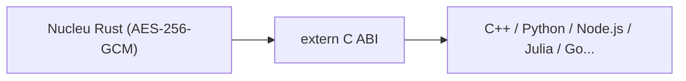

# Wiki — Security Core FFI

*Română · [English](../en/Home.md)*

## Notă asupra acestei ediții

Documentul de față reia și extinde documentația tehnică a proiectului **security-core-ffi**, reorganizând-o după convențiile unei lucrări de cercetare aplicată: context și motivație, model de amenințare, arhitectură formală, protocol de integrare și evaluare critică a limitărilor. Scopul este dublu — să rămână utilă unui inginer care vrea să integreze biblioteca într-un sistem real, și în același timp să documenteze riguros deciziile de design, astfel încât acestea să poată fi verificate, contestate sau extinse de oricine altcineva.

**Autor și conceptor al arhitecturii/codului:** [Ciprian Ștefan Pleșca](Autor.md)
**Contact:** contact@agentflow-enterprise.com

## Cuprins

- [Despre autor](Autor.md)
- [Arhitectură](Arhitectura.md)
- [Ghid de integrare (C++, Python, Node.js)](Ghid-de-Integrare.md)
- [Referință API FFI](Referinta-API.md)
- [Întrebări frecvente (FAQ)](FAQ.md)

## Rezumat

`security-core-ffi` este un nucleu de criptare autentificată (AES-256-GCM), scris în Rust pentru siguranța memoriei și expus printr-o interfață C stabilă (FFI). Ideea centrală e simplă de enunțat, dar greu de obținut corect în practică: logica de securitate — generarea nonce-urilor, verificarea tag-ului de autentificare, gestionarea cheii în memorie — trebuie scrisă *o singură dată*, într-un limbaj care elimină prin construcție clasele de bug-uri care afectează cel mai des cod-ul de criptografie scris manual (buffer overflow, use-after-free, data race). Restul limbajelor din ecosistem (C++, Python, Node.js și, în principiu, orice limbaj care poate lega o bibliotecă dinamică C) consumă acest nucleu printr-un contract stabil, fără să reimplementeze nimic din partea sensibilă.

Această separare — nucleu de încredere minimal + straturi consumatoare interschimbabile — este și motivul pentru care proiectul e organizat pe patru straturi, detaliate în pagina de [Arhitectură](Arhitectura.md).

## De ce contează acest proiect

Majoritatea vulnerabilităților critice din biblioteci de criptografie nu vin din alegerea greșită a algoritmului, ci din implementarea lui: un nonce refolosit din greșeală, un buffer eliberat de două ori, o cheie care rămâne în memorie mai mult decât trebuie. `security-core-ffi` mută aceste responsabilități într-un limbaj (Rust) care le tratează ca erori de compilare sau ca invarianți verificați la runtime, în loc să le lase la latitudinea fiecărui binding.

## Cum se citește această documentație

1. Cine vrea doar să integreze biblioteca rapid poate sări direct la [Ghidul de integrare](Ghid-de-Integrare.md).
2. Cine vrea să înțeleagă *de ce* API-ul arată așa cum arată ar trebui să citească întâi [Arhitectura](Arhitectura.md), unde sunt discutate modelul de amenințare și deciziile de design.
3. [Referința API](Referinta-API.md) este documentul de consultat rapid, funcție cu funcție, în timpul dezvoltării.
4. [FAQ](FAQ.md) adună întrebările care revin constant din partea celor care integrează biblioteca pentru prima dată.

---

[Home](Home.md) · [Arhitectură](Arhitectura.md) · [Ghid de Integrare](Ghid-de-Integrare.md) · [Referință API](Referinta-API.md) · [FAQ](FAQ.md) · [Autor](Autor.md)

<b>security-core-ffi</b> — arhitectură &amp; documentație de <a href="Autor.md"><b>Ciprian Ștefan Pleșca</b></a> 
Cercetător independent · <a href="mailto:contact@agentflow-enterprise.com">contact@agentflow-enterprise.com</a>

Ai găsit o problemă în documentație? Deschide o discuție sau contactează direct autorul. 
Pentru raportarea unei vulnerabilități de securitate, folosește <b>SECURITY.md</b> prin GitHub Security Advisories — nu această adresă de contact.

© 2026 Ciprian Ștefan Pleșca. Documentație menținută alături de proiectul <code>security-core-ffi</code>.

